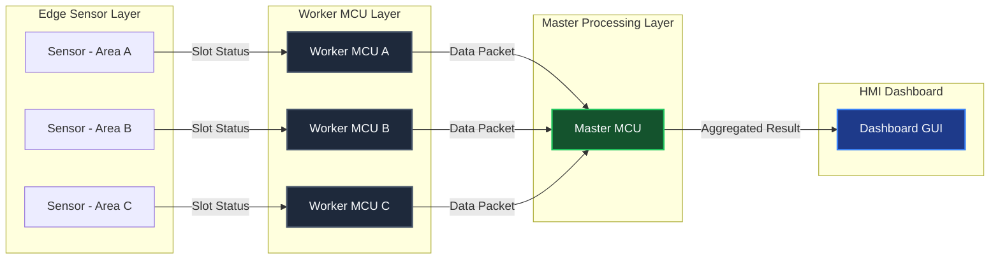
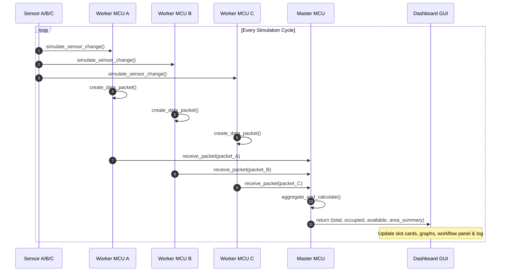
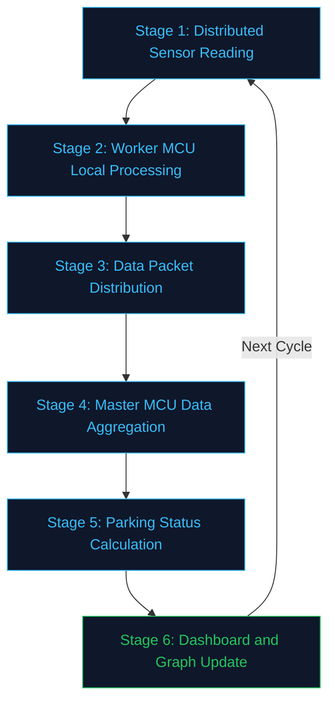
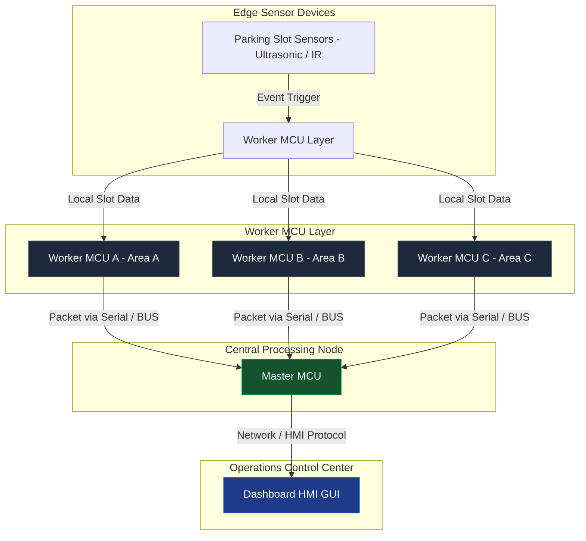

<h1 align="center">Smart Parking Multi-MCU Distribution Pipeline Workflow</h1>

## Evaluation 3 - IFB-206 KOMPUTASI PARALEL & SISTEM TERDISTRIBUSI

Ludhira Wira Darma Sastra Sonjaya - 152024011 

---

> **Parallel Computing & Distributed Systems Simulation**

[](https://www.python.org/)
[](https://docs.python.org/3/library/tkinter.html)
[](https://matplotlib.org/)
[](LICENSE)
[]()

---

## 1. Project Overview

The **Smart Parking Multi-MCU Distribution Pipeline Workflow** is an advanced simulation system designed to model a distributed smart parking management system. Developed as a final evaluation project for the **Parallel Computing and Distributed Systems** course, this system demonstrates the practical application of:

- **Distributed Processing**: Distributing parking sensor workloads across multiple independent virtual Worker MCUs, each responsible for a dedicated parking area zone.
- **Multi-Stage Pipeline Architecture**: Processing data through a sequential 6-stage distribution workflow that mirrors real embedded system communication chains.
- **Virtual Embedded Architecture**: Modeling physical hardware boundaries (Sensor Nodes, Worker MCUs, Master MCU) through independent, isolated Python modules with clean separation of responsibility.
- **Real-Time Monitoring Dashboard**: Providing a live monitoring GUI with ECG-style heartbeat signal graphs, per-area bar charts, workflow stage indicators, and a communication log console.

By combining these paradigms, the simulator demonstrates how modern smart city parking infrastructures handle high-frequency sensor event streams while maintaining consistent, low-latency data aggregation in a Master-Worker MCU topology.

---

## 2. Key Features

- **Multi-MCU Distributed Architecture**: Implements a Master-Worker MCU topology where 3 virtual Worker MCUs independently manage their own parking zones and forward aggregated data packets to a central Master MCU.
- **6-Stage Distribution Pipeline**: Sequentially walks through each workflow stage with animated stage indicators, making the distributed communication model visually explicit and traceable.
- **Modular Codebase**: Source code is cleanly separated into `nodes/`, `simulator/`, and `dashboard_gui.py` — each with a single, well-defined responsibility.
- **Real-Time ECG/Heartbeat Graph**: Renders a live heartbeat-style waveform representing parking slot activity signals, with amplitude modulated by the current number of occupied slots.
- **Per-Area Bar Chart**: Displays the number of occupied slots for each Worker MCU zone, updated in real time every simulation cycle.
- **Animated Workflow Stage Panel**: Highlights which pipeline stage is currently executing, using blue active indicators and grey idle indicators.
- **Dark Console Communication Log**: Appends timestamped communication messages from every Worker MCU at each pipeline stage for traceability.
- **Slot Status Cards**: Visual parking slot buttons for each Worker MCU that toggle between green (KOSONG) and red (TERISI) states to represent real-time occupancy changes.
- **Interactive Controls**: Start, Stop, and Reset simulation controls for full lifecycle management.

---

## 3. System Architecture

The simulation operates as a Master-Worker distributed topology. Each Worker MCU independently reads its sensors, processes local data, and forwards packets up to the Master MCU for global aggregation:



### Node Description

| Node Identifier    | Name                     | Responsibility                                                                       | Output                          |
| :----------------- | :----------------------- | :----------------------------------------------------------------------------------- | :------------------------------ |
| **Sensor A/B/C**   | Virtual Parking Sensor   | Simulates IoT ultrasonic/IR sensors detecting vehicle presence per slot.             | Slot status change events       |
| **Worker MCU A**   | Area A Local Controller  | Reads sensor changes for slots A1–A3 and creates serialized data packets.            | Data Packet → Master MCU        |
| **Worker MCU B**   | Area B Local Controller  | Reads sensor changes for slots B1–B3 and creates serialized data packets.            | Data Packet → Master MCU        |
| **Worker MCU C**   | Area C Local Controller  | Reads sensor changes for slots C1–C3 and creates serialized data packets.            | Data Packet → Master MCU        |
| **Master MCU**     | Central Aggregation Node | Receives all Worker packets, aggregates totals, and calculates global parking status. | Aggregated result → GUI         |
| **Dashboard GUI**  | HMI Monitoring Console   | Renders live slot cards, graphs, workflow indicators, and communication log.          | Visual Display & Activity Graph |

---

## 4. Distributed System Design

Each Worker MCU operates independently as a local embedded edge node. They do not communicate with each other — all inter-node communication is strictly Worker-to-Master, enforcing separation of concerns and avoiding shared-state hazards:



- **Decoupled Workers**: Each Worker MCU independently processes its own sensor zone without knowledge of other workers, mirroring physical embedded MCU isolation.
- **Centralized Aggregation**: The Master MCU receives all incoming packets and performs global occupancy calculations in a single aggregation pass.
- **Non-Blocking GUI**: The dashboard uses `root.after()` callbacks to schedule each pipeline stage with configurable delays (`stage_delay`, `cycle_delay`), ensuring the GUI thread never freezes during processing.

---

## 5. Distribution Pipeline Workflow

The simulation explicitly models each communication and processing stage as a distinct, observable pipeline step. Each stage activates a visual indicator on the dashboard before proceeding:



### Stage Description

| Stage | Name                          | Module Responsible              | Description                                                                                                 |
| :---: | :---------------------------- | :------------------------------ | :---------------------------------------------------------------------------------------------------------- |
| **1** | Distributed Sensor Reading    | `simulator/parking_generator.py` | Each Worker MCU calls `simulate_slot_change()` — slots toggle with 25% probability per cycle.              |
| **2** | Worker MCU Local Processing   | `nodes/worker_mcu.py`           | Each Worker calls `create_data_packet()` to serialize slot data with a timestamp into a dict packet.        |
| **3** | Data Packet Distribution      | `nodes/master_mcu.py`           | All Worker MCUs forward their packets via `receive_packet()` to the Master MCU's buffer.                    |
| **4** | Master MCU Data Aggregation   | `nodes/master_mcu.py`           | `aggregate_and_calculate()` iterates all packets and sums per-area and global slot totals.                  |
| **5** | Parking Status Calculation    | `dashboard_gui.py`              | Dashboard labels (Total, Occupied, Available, Cycle) are updated from the aggregation result.               |
| **6** | Dashboard and Graph Update    | `dashboard_gui.py`              | ECG heartbeat graph and per-MCU bar chart are redrawn. Cycle repeats after `cycle_delay`.                   |

---

## 6. Virtual Embedded System Architecture

The software components are mapped directly to mirror a real IoT embedded hardware topology, simulating physical MCU boundaries in a virtual environment:



- **Worker MCU (Edge Node)** → `nodes/worker_mcu.py`: Handles local sensor interfacing and data serialization independently. Each node only knows about its own parking zone.
- **Master MCU (Gateway Node)** → `nodes/master_mcu.py`: Acts as the central data broker. Receives packets from all workers and calculates system-wide parking status.
- **Simulator** → `simulator/parking_generator.py`: Decoupled randomized sensor event generator consumed by all Worker MCUs.
- **HMI Dashboard (Control Room)** → `dashboard_gui.py`: The SCADA-equivalent display console. Renders occupancy visuals, live signal graphs, and logs all inter-MCU communication events.

---

## 7. Dashboard Features

The Human-Machine Interface (HMI) provides a clean monitoring panel for the simulated parking system:

1. **Header Panel**: Displays the system title and subtitle describing the simulation paradigm in full.
2. **Worker MCU Slot Cards**: Three area cards (Area A, B, C), each displaying 3 parking slot buttons that toggle between green `KOSONG` (empty) and red `TERISI` (occupied) states, with a last-update timestamp from the Worker MCU.
3. **Master MCU Dashboard Card**: Displays live counters for Cycle number, Total Slots, Slots Occupied (`Slot Terisi`), and Slots Available (`Slot Kosong`).
4. **Distribution Pipeline Workflow Panel**: A 6-stage indicator list where the active stage is highlighted in blue (`●`) and idle stages remain grey (`○`), with a status text line showing the current stage description.
5. **Communication Log Console**: A dark-themed scrollable text box that appends timestamped messages for every packet distribution and local processing event across all Worker MCUs.
6. **Real-Time Parking Activity Signal (ECG Graph)**: A heartbeat-style waveform chart where amplitude is modulated by the number of occupied slots, providing an analog-style system activity visualization.
7. **Slot Terisi per Worker MCU (Bar Chart)**: A bar chart comparing occupied slot counts across all three Worker MCU areas, updated every cycle.
8. **Control Buttons**: **Start Simulation**, **Stop**, and **Reset** buttons for complete lifecycle management.

---

## 8. Installation & Requirements

### Prerequisites

- **Python 3.10+** (Ensure Python is added to the system environment `PATH`)
- **OS Support**: Windows, Linux, or macOS (tested on Windows 11)

### Package Dependencies

The simulation uses `matplotlib` for plotting. `tkinter` is included in the Python standard library.

```bash
pip install matplotlib
```

---

## 9. How To Run

Ensure you are located inside the root project directory.

### Running the Simulation

```bash
python main.py
```

- **Behavior**: The GUI window will open. Click **"Start Simulation"** to begin the automated distribution pipeline workflow. The slot cards, graphs, workflow indicators, and communication log will all update in real time.
- **Stop**: Click **"Stop"** to pause the simulation loop at any time without resetting state.
- **Reset**: Click **"Reset"** to clear all slot states, graph history, log output, and cycle counter back to initial conditions.

---

## 10. Project Structure

```
CuffnCode/
│
├── main.py                          # Application entry point — launches the HMI dashboard
├── dashboard_gui.py                 # Main Tkinter SCADA HMI dashboard & pipeline orchestrator
├── smart_parking_simulation.py      # Legacy monolithic version (single-file reference)
│
├── nodes/
│   ├── __init__.py                  # Re-exports WorkerMCU and MasterMCU
│   ├── worker_mcu.py                # WorkerMCU: distributed edge node — sensor read & packet creation
│   └── master_mcu.py                # MasterMCU: central aggregation node — packet collection & calculation
│
├── simulator/
│   ├── __init__.py                  # Re-exports simulator public API
│   └── parking_generator.py         # Random slot occupancy state change simulator (25% probability)
```

### Module & Class Overview

| File                             | Class / Function                    | Responsibility                                                                                               |
| :------------------------------- | :---------------------------------- | :----------------------------------------------------------------------------------------------------------- |
| `main.py`                        | `main()`                            | Initializes Tk root window and hands control to the GUI class.                                               |
| `dashboard_gui.py`               | `SmartParkingDistributionWorkflowGUI` | Owns all widgets, orchestrates the 6-stage pipeline via `root.after()`, manages graphs and the log console. |
| `nodes/worker_mcu.py`            | `WorkerMCU`                         | Simulates an edge MCU node managing 3 parking slots. Handles sensor reads and packet creation.               |
| `nodes/master_mcu.py`            | `MasterMCU`                         | Receives packets from all Worker MCUs, aggregates data, and computes global occupancy statistics.            |
| `simulator/parking_generator.py` | `simulate_slot_change()`            | Decoupled random slot-toggle function — 25% probability per slot per cycle. Used by all Worker MCUs.         |

---

Presented inside a clean, interactive monitoring dashboard with a fully modular architecture, this project stands as a fully integrated showcase of **Distributed System** design, **Multi-MCU communication pipeline**, and **real-time embedded simulation** principles.
